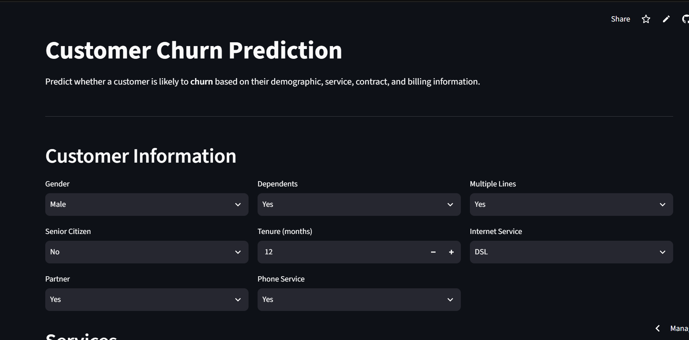

# Customer Churn Analysis & Prediction

An end-to-end customer churn analytics and machine learning project that combines data cleaning, exploratory analysis, SQL business analysis, machine learning classification, and an interactive Streamlit dashboard.

The project is designed to help businesses identify customers who are at higher risk of churn and understand the factors associated with customer attrition.

---

## Project Overview

Customer churn is a major business problem because retaining existing customers is often more valuable than continuously acquiring new ones.

This project analyzes telecom customer data to:

- Understand customer churn patterns
- Identify customer segments associated with higher churn
- Perform business-oriented analysis using SQL
- Build machine learning models to predict churn
- Compare multiple classification algorithms
- Provide an interactive churn prediction interface
- Present important business metrics through a Streamlit dashboard

---

## Live Application

 **[Try the live Streamlit application](https://customer-churn-analysis-prediction-lxmv8fuz7dlkcvoticrdwy.streamlit.app/)**



## Objectives

### Primary Objective

To develop an end-to-end machine learning solution for analyzing and predicting customer churn.

### Specific Objectives

1. Clean and preprocess the customer dataset.
2. Perform exploratory data analysis to understand churn patterns.
3. Conduct SQL-based business analysis.
4. Identify customer segments associated with higher churn risk.
5. Train and compare multiple classification models.
6. Evaluate models using appropriate classification metrics.
7. Deploy the selected model through an interactive Streamlit application.
8. Provide business-oriented insights and recommendations.

---

## Dataset

The project uses the **IBM Telco Customer Churn Dataset**.

### Original Dataset

- Records: **7,043 customers**
- Features: **21 columns**
- Target variable: `Churn`

The target variable contains:

- `Yes` — customer churned
- `No` — customer did not churn

### Data Cleaning

The `TotalCharges` column initially contained values stored as text.

The following preprocessing was performed:

- Converted `TotalCharges` to numeric
- Invalid/blank values were converted to missing values
- Rows with missing `TotalCharges` were removed
- Created a binary `ChurnFlag` variable:
  - `0` = No churn
  - `1` = Churn

After cleaning:

- Records: **7,032**
- Columns: **22**

The additional column is `ChurnFlag`.

---

## Exploratory Data Analysis

The exploratory analysis examines customer churn across several dimensions, including:

- Overall churn distribution
- Contract type
- Customer tenure
- Monthly charges
- Payment method
- Internet service
- Customer demographics

The analysis is intended to identify patterns and customer characteristics associated with churn.

---

## SQL Business Analysis

The cleaned dataset was loaded into a **SQLite database** for business-oriented analysis.

The SQL analysis includes:

1. Total number of customers
2. Overall churn rate
3. Churn by contract type
4. Churn by tenure group
5. Churn by internet service
6. Churn by payment method
7. Churn by gender
8. Churn by senior citizen status
9. High-value customers
10. High-risk customer segments
11. High-risk customers who have not yet churned
12. Customer value segmentation
13. Average monthly charges by churn status
14. Average tenure by churn status
15. Average total charges by churn status

This allows the project to move beyond prediction and translate customer data into business-oriented analysis.

---

## Machine Learning

Three classification algorithms were trained and compared:

### 1. Logistic Regression

### 2. Random Forest

### 3. Gradient Boosting

A preprocessing pipeline was created to handle:

- Numerical features
- Categorical features
- Missing values
- Feature scaling
- One-hot encoding

The data was split into training and testing sets using an **80/20 split** with stratification.

---

## Model Performance

| Model | Accuracy | Precision | Recall | F1-Score | ROC-AUC |
| --- | ---: | ---: | ---: | ---: | ---: |
| Logistic Regression | 0.8038 | 0.6485 | 0.5722 | 0.6080 | 0.8359 |
| Random Forest | 0.7605 | 0.5414 | 0.6471 | 0.5895 | 0.8154 |
| Gradient Boosting | 0.7932 | 0.6326 | 0.5294 | 0.5764 | **0.8392** |

### Selected Model

**Gradient Boosting** was selected as the primary model based on its highest ROC-AUC score:

**ROC-AUC = 0.8392**

However, the comparison also shows that:

- Logistic Regression achieved the highest accuracy and F1-score.
- Random Forest achieved the highest recall.
- Gradient Boosting achieved the highest ROC-AUC.

This highlights the importance of selecting a model according to the business objective rather than relying on a single metric.

---

## Streamlit Application

The project includes an interactive Streamlit application.

The application provides two major components:

### Customer Churn Prediction

Users can enter customer information such as:

- Demographics
- Tenure
- Contract type
- Internet service
- Payment method
- Monthly charges
- Total charges
- Additional services

The application then provides:

- Churn prediction
- Churn probability
- Risk level
- Business recommendation

### Analytics Dashboard

The dashboard provides:

- Total customers
- Churned customers
- Overall churn rate
- Average monthly charges
- Churn distribution
- Churn by contract
- Churn by payment method
- Churn by internet service
- Average tenure by churn
- Average monthly charges by churn
- High-risk customer segment

---

## High-Risk Customer Segment

A high-risk segment is defined in the application as customers who satisfy all three conditions:

```text
Contract = Month-to-month
Tenure <= 12 months
MonthlyCharges > 70

### Technologies Used
Programming & Analysis
Python
Pandas
NumPy
Scikit-learn
Database
SQLite
SQL
Machine Learning
Logistic Regression
Random Forest
Gradient Boosting
Scikit-learn Pipelines
Visualization
Matplotlib
Streamlit
Deployment
Streamlit Community Cloud
GitHub

### Project Structure
customer-churn-analysis-prediction/
│
├── data/
│   ├── Telco-Customer-Churn.csv
│   └── cleaned_churn_data.csv
│
├── models/
│   └── churn_model.pkl
│
├── notebooks/
│   ├── 01_data_cleaning_eda.ipynb
│   ├── 02_modeling.ipynb
│   └── 03_sql_analysis.ipynb
│
├── sql/
│   ├── churn_analysis.db
│   └── churn_analysis.sql
│
├── src/
│   ├── load_sql_database.py
│   ├── preprocessing.py
│   ├── train_model.py
│   └── predict.py
│
├── app.py
├── README.md
├── requirements.txt
└── .gitignore

## How to Run Locally
1. Clone the repository
git clone https://github.com/YOUR-USERNAME/customer-churn-analysis-prediction.git
2. Navigate into the project
cd customer-churn-analysis-prediction
3. Create a virtual environment
python -m venv .venv
4. Activate the environment
Windows
.venv\Scripts\activate
macOS/Linux
source .venv/bin/activate
5. Install dependencies
pip install -r requirements.txt
6. Run the Streamlit application
streamlit run app.py

The application will open in your browser.

## Business Applications
The project demonstrates how churn prediction can support:

Customer retention campaigns
Targeted offers
Customer segmentation
Early identification of at-risk customers
Service improvement strategies
Data-driven customer relationship management

A business could use churn probabilities to prioritize retention efforts toward customers with higher predicted churn risk.

## Limitations
The dataset represents a specific telecom customer population and may not generalize to every business.
Model performance depends on the available customer attributes.
Churn predictions are probabilistic and should not be treated as certain outcomes.
The project does not incorporate real-time customer behavior.
Business decisions should combine model predictions with additional customer and operational information.

## Future Improvements
Potential improvements include:

Hyperparameter optimization
Cross-validation
Explainable AI using SHAP
Model monitoring
Automated retraining
Real-time prediction APIs
Customer lifetime value analysis
Automated retention recommendations
Integration with CRM systems
Improved class-imbalance handling
Model calibration

# Dataset Source

IBM Telco Customer Churn Dataset:

https://github.com/IBM/telco-customer-churn-on-icp4d

### Author

Shruti Tyagi

B.Sc. Statistics and Data Science
CHRIST (Deemed to be) University

## Project Highlights

This project demonstrates an end-to-end data science workflow:

Raw Data
   ↓
Data Cleaning
   ↓
Exploratory Data Analysis
   ↓
SQL Business Analysis
   ↓
Feature Preprocessing
   ↓
Machine Learning
   ↓
Model Evaluation
   ↓
Churn Prediction
   ↓
Interactive Dashboard
   ↓
Deployment

### Save the file

Then run:

```powershell
type README.md
